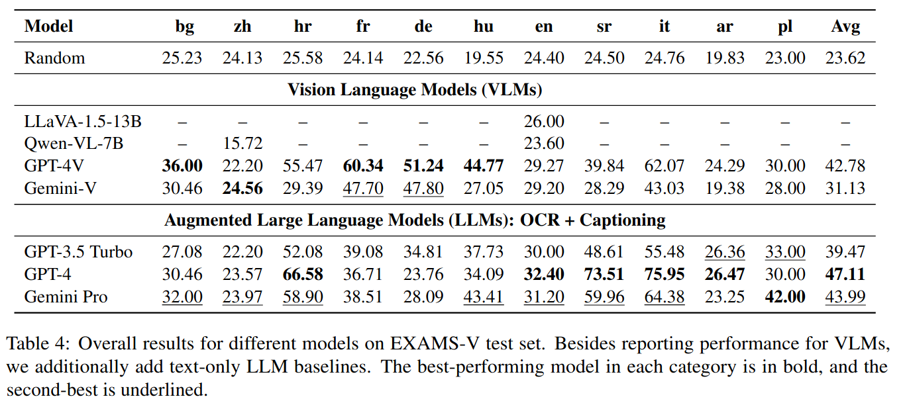
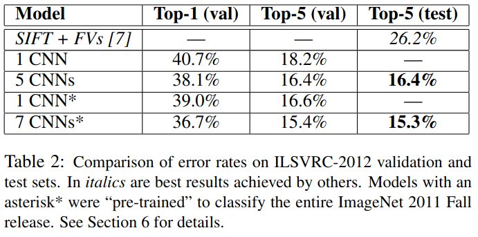
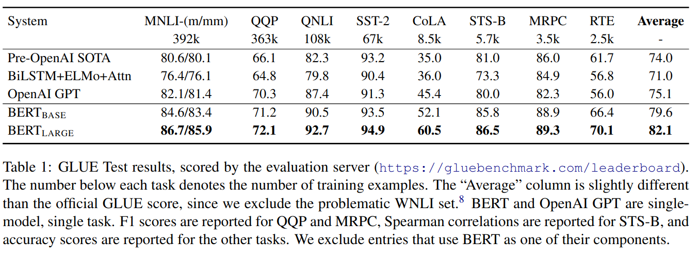

## TODO

0. Може би първо мини материала в репото.

✅　1. Статии
    - Collaborative Filtering
    - Content-Based Filtering
    - Хибридни
    - Рекурентни невронни мрежи, Автоенкодери.

✅　2. Данни
    - намери датасет, нещо със заглавия, жанрове, тагове и някаква обратна връзка като рейтинг.

3. Обработи датасета: "брой наблюдения, брой и тип на характеристиките, статистически зависимости в данните, аномалии в данните. Докладване и анализ, илюстриран с подходящи визуализации и придружен с коментари". +тестове?

4. Базов модел - най-висок рейтинг да кажем ?? +тестове

5. Term Frequency-Inverse Document Frequency + косинусова близос. +тестове

6. Bag of Words. Сравни с 5. +тестове

7. Collaborative Filtering чрез Singular value decomposition. Сравни с 5. +тестове

8. RNN. Сравни с 5. И 7. +тестове

9. Автоенкодер. Сравни с 5., 7. и 8. +тестове

10. Streamlit интерфейс. +тестове

11. Документация и презентация.

## Sources

- https://medium.com/@corymaklin/model-based-collaborative-filtering-svd-19859c764cee

- https://www.reddit.com/r/learnmachinelearning/comments/q8g1i3/how_can_singular_value_decomposition_be_used_in/

-  Recommendation System Using Autoencoders by Diana Ferreira, Sofia Silva, António Abelha and José Machado (https://www.mdpi.com/2076-3417/10/16/5510) - автоенкодер с по-висока производителност от SVD при оскъдни данни. Имплементира дропаут (datasets movielens)

- Recommendation System With Hierarchical Recurrent Neural Network for Long-Term Time Series Byeongjin Choe; Taegwan Kang; Kyomin Jung (https://ieeexplore.ieee.org/abstract/document/9430555) йерархична рекурентна, предсказва следващия избор на клиент (dataset Movielens 1 million movie review)

- Remembering past and predicting future: a hybrid recurrent neural network based recommender system (https://pmc.ncbi.nlm.nih.gov/articles/PMC9440998/) - добавя разнообразие, приема, че вкусът се променя

- Collaborative Recurrent Autoencoder: Recommend while Learning to Fill in the Blanks (https://arxiv.org/abs/1611.00454) fill in the blank and beta pooling са новости (датасетове CiteULike, Netflix)

- A Survey on Deep Neural Networks in Collaborative Filtering Recommendation Systems (https://arxiv.org/abs/2412.01378) за бейслайн MLP, за оскъдни данни - автоенкодери.

- Development of a Hybrid Recommendation System Using Collaborative Filtering and Content-Based Filtering Techniques (www.irejournals.com/formatedpaper/1708607.pdf) комбинация collab + conten е по-оптимално от само едното (датасетове movielens и netflix) 

- From Traditional Filtering to Deep Representations: A Systematic Review of Neural Architectures in Recommender Systems (https://www.researchgate.net/publication/397608567_From_Traditional_Filtering_to_Deep_Representations_A_Systematic_Review_of_Neural_Architectures_in_Recommender_Systems) дълбоки мрежи = по-висока производителност, но искат изчислителна мощ и може да са трудни за обяснение. 

- anime recommender with RAG https://medium.com/@tahasinahoni2/from-data-to-recommendations-how-i-built-an-anime-recommender-with-rag-and-vector-databases-7fb99c77b4cc

// preview only <br>
// Auto-Encoder based Hybrid Collaborative Filtering System
Shelke, Nikhil Sunil (https://www.proquest.com/openview/b913e3f4bf976a6aac23e7d7cd3d422e/1?pq-origsite=gscholar&cbl=18750&diss=y)
// Deep autoencoders for feature learning with embeddings for recommendations: a novel recommender system solution Kiran Rama, Pradeep Kumar & Bharat Bhasker (https://link.springer.com/article/10.1007/s00521-021-06065-9)
  - datasets MovieLens100K: http://files.grouplens.org/datasets/movielens/ml-latest-small.zip, MovieLens1M: http://files.grouplens.org/datasets/movielens/ml-1m.zip, FilmTrust: https://www.librec.net/datasets/filmtrust.zip.

  // Deep learning-based collaborative filtering recommender systems: a comprehensive and systematic review

## Dataset 

- може би най-пълен https://github.com/Hernan4444/MyAnimeList-Database/tree/master скрейпнат от сайт 

- също много пълен от Kaggle 24905 заглавия. https://www.kaggle.com/datasets/dbdmobile/myanimelist-dataset

- най-популярен в Kaggle 12292 заглавия, анонимизирани юзъри. Малък размер. https://www.kaggle.com/datasets/CooperUnion/anime-recommendations-database

## Assignment: 
1. Генериране на препоръка.
Пример:
   - Цел: Създаване на уеб апликация за предложение на шеги.
   - Ресурси: https://en.wikipedia.org/wiki/Recommender_system.
   - Набор от данни: Jester Datasets for Recommender Systems, https://eigentaste.berkeley.edu/dataset/.
Задължителни стъпки:
1. Разучаване на научни статии и техники за построяване на препоръчващи системи - Collaborative Filtering, Content-Based Filtering, Хибридни, Рекурентни невронни мрежи, Автоенкодери.
2. Разглеждане на данните - брой наблюдения, брой и тип на характеристиките, статистически зависимости в данните, аномалии в данните. Докладване и анализ, илюстриран с подходящи визуализации и придружен с коментари.
3. Експерименти със създаване на TF-IDF вектори и използване на косинусова близост. Сравняване с BoW (bag-of-words).
4. Експерименти с използване на алгоритъма SVD за реализация на Collaborative Filtering. Сравняване с TF-IDF векторизацията.
5. Сравняване на горните два подхода с различни невронни мрежи, решаващи същата задача (например една рекурентна и един автоенкодер).
6. Създаване на потребителски интерфейс с пакета streamlit. Изготвяне на тестове, написани по начина, показан на упражнения.
7. Изготвяне на презентация, описваща подхода за реализиране на проекта.


## Two of the most important deliverables are:

Behavior-driven development.

Presence of a model report file.


## Behavior-driven development

Employing behavior-driven development is strongly encouraged in your work. You can read more about it [in Wikipedia](https://en.wikipedia.org/wiki/Behavior-driven_development). A nice side effect from practicing BDD is that the code coverage will be $100\%$.

Principles:

1. Write tests first and only then make them pass.
2. Test names conform to the convention `test_when_<condition>_then_<expectation>`.
   1. The "condition" part should explain under what conditions the functionality-under-test is invoked.
   2. The "expectation" is the behavior of the functionality-under-test.
   3. The test name should focus on defining a single behavior expected from the functionality-under-test.
   4. Example: `test_when_batch_size_is_negative_then_value_errror_is_raised`.
3. A single unit test should test exactly one behavior.
4. A test name that is too long suggest that the **code-under-test** (note: not the test / test name itself) should be refactored.
5. Each class gets dedicated test module (`test_model_trainer.py`).
6. Each function/method gets its own test class. One test class per function/method (`test_when_batch_size_is_negative_then_value_errror_is_raised`).

More examples:

```python
# my_package/myclass.py
class MyClass:
    def do_something_with_an_integer(self, param1: int) -> int:
        ...

    def my_second_method(self)
        ...
```

```python
# tests/test_myclass.py
import unittest

class TestDoSomethignWithAnInteger(unittest.TestCase):
    def test_when_called_with_integer_then_returns_integer(self):
        ...
    
    def test_when_called_with_string_then_raises_value_error(self):
        ...

class TestMySecondMethod(unittest.TestCase):
    ...
```

## The Model Report File

Whenever we're building a model, we're going to have to produce the so-called **Model report**. This is an Excel file, but serves as the basis of our work and tells the story of our journey. It is typically **presented to your clients** and shows what has been tried out, what worked, what didn't and, ultimately, which is the best model for the task.

Here're the guidelines we'll follow:

1. Each row is a hypothesis - a model that was trained and evaluated.
2. The columns are divided into two sets: the first set of columns represent the values of the hyperparameters of the model, the second set: the metrics on the **test** set. Do not use more than `3` metrics.
3. The first row holds the so-called **baseline model**. This model can be only one of two things: if currently there is a deployed model on the client's environment, then it is taken to be the baseline model. Otherwise the baseline model is the greediest statistical model. For example, this is the model that predicts the most common class in classification problems.
4. The columns that show the metrics express both the value of the metric as well as the percentage of change **compared to the *baseline* model** (we're striving for percentage increase, but should report every case).
5. The rightmost column should be titled `Comments` and should hold our interpretation of the model (what do we see as metrics, is it good, is it bad, etc). We may include the so-called `Error Analysis` which details where this model makes mistakes.
6. Above or below the main table there should be a cell that **explicitly** states which is the best model and why.
7. Below the table or in other sheets there should be the following diagrams: `train vs validation metric` (the main metric used) and if the model outputs a loss, we should have a `train vs validation loss` diagram.
8. The table should not be a pandas export - it should be coloured and tell the story of modelling. Bold and/or highlight the entries in which the metric is highest or to which you want to draw attention to.
9. Do not sort the table after completing the experiments - it should be in the order of the created models. This lets you build up on the section `Comments` and easily track the changes made.
10. Do not create a very wide table - it **should be easy to understand which is the best model** in one to two seconds of looking at it. Focus on the user experience.
11. Optionally, you could create an additional sheet for the best model in which you put 4-5 examples of correct and incorrect predictions. This will control the client's expectations.

> **Tip**: Since we're talking about doing a lot of experiments (typically `50` - `200`), you'll find it tedious to use Jupyter notebooks. Instead, create **scripts** and run them **in parallel**. This will speed up modelling speed tremendously!

The end result is a table that is present in most scientific papers. Here are some examples:

- [EXAMS-V: A Multi-Discipline Multilingual Multimodal Exam Benchmark for Evaluating Vision Language Models](https://arxiv.org/pdf/2403.10378)



- [ImageNet Classification with Deep Convolutional Neural Networks](https://proceedings.neurips.cc/paper_files/paper/2012/file/c399862d3b9d6b76c8436e924a68c45b-Paper.pdf)



- [BERT: Pre-training of Deep Bidirectional Transformers for Language Understanding](https://arxiv.org/pdf/1810.04805)



Examine example projects list "примерни теми" and the lecturer instructions. Sort by time for completion if building a minimum possible simple version.

